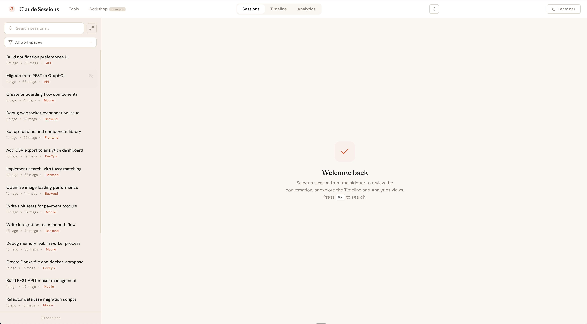
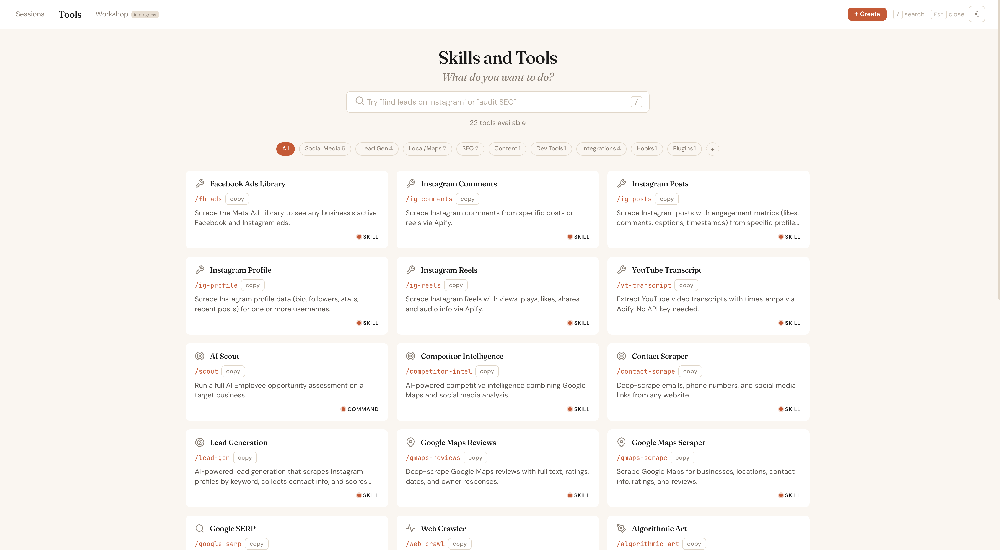

# Claude Code Dashboard

A local web dashboard for browsing your Claude Code sessions and discovering your skills, tools, and integrations.

 

## Quick Start

Paste this into Claude Code:

```
Clone https://github.com/M1w234/claude-terminal-sessions-dashboard and run the setup.sh script to install it. It's a web dashboard for browsing my Claude Code sessions and a catalog of all my skills/tools. If I'm missing any dependencies like python3, fastapi, or uvicorn, help me install them first. After setup, open http://localhost:3456 in my browser.
```

That's it. Claude Code handles the rest.





## What You Get

### Sessions Dashboard (`localhost:3456`)
- **Session Browser** — Search and browse all your Claude Code sessions
- **Conversation Viewer** — Read through past sessions with formatted messages and tool calls
- **Embedded Terminal** — Resume sessions with one click
- **Timeline View** — Sessions organized by day
- **Analytics** — Session counts, activity charts, projects and branches breakdown
- **Workspace Filters** — Filter sessions by workspace
- **AI Summaries** — Generate quick summaries of any session

### Tools (`localhost:3456/tools`)
- **Auto-detected catalog** — Automatically discovers all your skills, commands, hooks, plugins, and MCP servers
- **Search** — Keyword search with synonym expansion, or LLM-powered Smart Search
- **Category filters** — Filter by Social Media, Lead Gen, SEO, Content, Dev Tools, CLI, Hooks, Plugins, and more
- **Detail panels** — Click any tool for full description, use cases, related tools, and copy-to-clipboard
- **Skill Planner** — Chat-based planning assistant (powered by Claude) for designing new skills or modifying existing ones. Produces briefs for `/skill-creator`
- **Dark mode** — Toggle or auto-detects from OS preference
- **Keyboard navigation** — `/` to search, arrow keys to browse, `Esc` to close

## How Auto-Detection Works

The tools page **automatically detects** everything on your machine:

| Source | Auto-detected from |
|--------|-------------------|
| Skills | `~/.claude/skills/*/skill.md` (reads YAML frontmatter) |
| Commands | `~/.claude/commands/*.md` |
| Hooks | `~/.claude/hooks/*.sh` |
| Plugins | `~/.claude/plugins/marketplaces/*/plugins/` |
| MCP servers | `~/.claude/plugins/marketplaces/*/external_plugins/` |
| CLI commands | `tools-static.json` (ships with universal Claude Code commands) |

**No configuration needed** — just install and your tools appear.

### Adding Cloud MCP Integrations

Local MCP servers (installed via plugins) are auto-detected. Cloud-hosted integrations (Notion, Canva, Slack, etc.) vary per user, so they're configured in `tools-static.json`. Add entries like:

```json
{
  "id": "notion",
  "name": "Notion",
  "command": "(ask Claude)",
  "type": "mcp",
  "category": "mcp",
  "description": "Search, create/update pages, manage databases and comments.",
  "useCases": ["manage docs and notes", "create a Notion page"],
  "tags": ["notion", "docs", "pages", "workspace"],
  "related": [],
  "source": "mcp"
}
```

### Enriching Skill Metadata

The auto-scan gets each skill's name and description from its frontmatter. For richer search (use cases, tags, related tools), add entries to `tools.json`:

```json
{
  "my-skill-id": {
    "category": "dev",
    "useCases": ["when I want to do X", "when I need Y"],
    "tags": ["keyword1", "keyword2"],
    "related": ["other-skill-id"]
  }
}
```

Or use the Skill Planner's **Enrich** mode to auto-generate these.

## Requirements

- macOS
- Python 3.10+
- Claude Code installed (`~/.claude/` directory must exist)
- For Smart Search and Skill Planner: Claude CLI (`claude` command available)

## Manual Install

```bash
git clone https://github.com/M1w234/claude-terminal-sessions-dashboard.git
cd claude-terminal-sessions-dashboard
pip install fastapi uvicorn anthropic
./setup.sh
```

Then open **http://localhost:3456** (sessions) or **http://localhost:3456/tools** (tools).

## Architecture

Two lightweight servers run on localhost:

| Service | Port | Purpose |
|---------|------|---------|
| Dashboard | 3456 | Web UI + REST API for sessions and tools catalog |
| Terminal | 3457 | WebSocket server for the embedded terminal |

Both are managed by macOS LaunchAgents and start automatically on login.

### API Endpoints

| Endpoint | Method | Purpose |
|----------|--------|---------|
| `/api/sessions` | GET | List all sessions with search/filter |
| `/api/catalog` | GET | Auto-scanned tools catalog |
| `/api/skill/{id}/content` | GET | Full skill.md content |
| `/api/smart-search` | POST | LLM-powered search via Claude CLI |
| `/api/skill-builder` | POST | Skill Planner conversation |

## Keyboard Shortcuts

### Sessions
- **Cmd+K** — Focus search
- **Cmd+`** — Toggle terminal
- **Esc** — Clear search

### Tools
- **/** — Focus search
- **Arrow keys** — Navigate cards
- **Enter** — Open detail panel
- **Esc** — Close panels

## File Reference

| File | Purpose |
|------|---------|
| `index.html` | Sessions dashboard frontend |
| `tools.html` | Tools catalog frontend |
| `workshop.html` | Ideas Workshop frontend (WIP) |
| `server.py` | FastAPI backend (sessions + catalog + smart search + skill builder) |
| `terminal_server.py` | WebSocket terminal server |
| `tools.json` | Enrichment data for skills (useCases, tags, related) |
| `tools-static.json` | User-configurable entries (CLI commands, cloud MCP integrations) |
| `setup.sh` | Installation script (copies files, creates LaunchAgents) |
